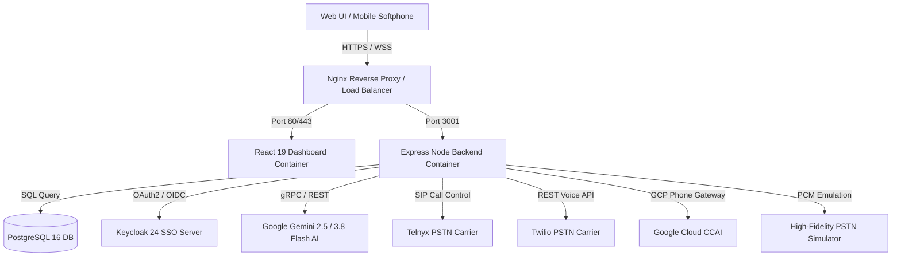
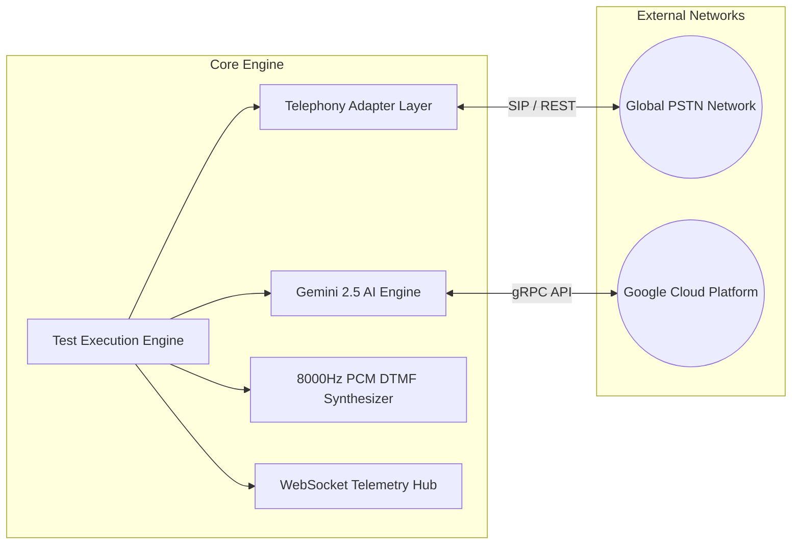
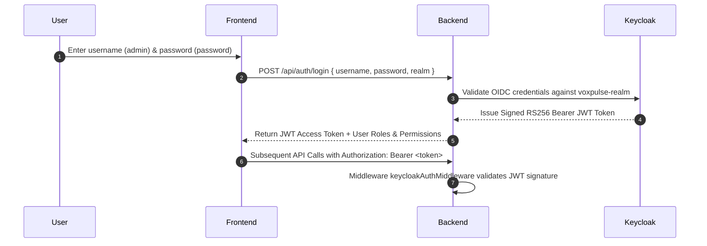
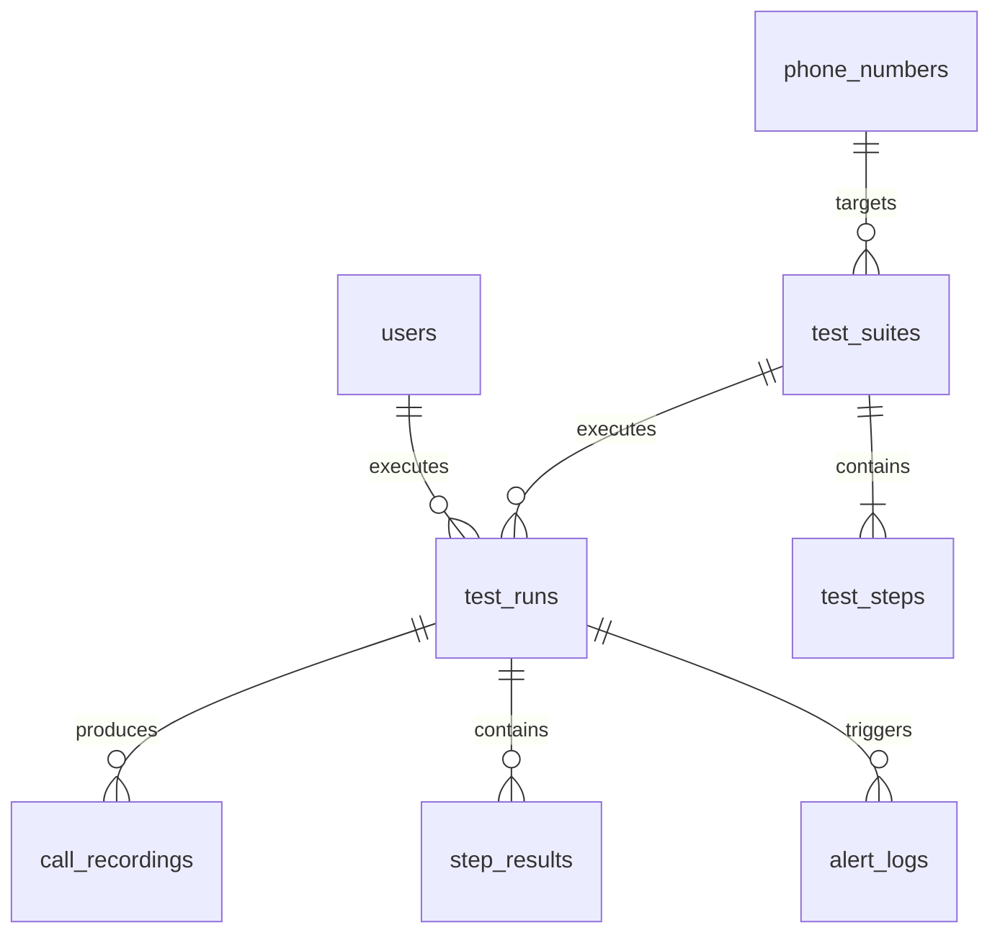

# 🏛️ VoxPulse AI - High-Level Architecture (HLD)
> **Document Version:** 1.0.0-enterprise  
> **Classification:** Technical Architecture Specification  
> **Target Audience:** Enterprise Architects, DevOps, Lead Engineers  

---

## 1. System Vision & Enterprise Mission

**VoxPulse AI** is an autonomous, enterprise-grade cloud platform designed to replace legacy 3rd-party vendor SaaS solutions such as **Klearcom**, **Cyara**, and **Hammer**. It delivers continuous 24/7 PSTN outbound and inbound call testing, multi-carrier SIP trunk diagnostics, POLQA/PESQ audio MOS scoring, AI voicebot barge-in benchmarking, and global DID reachability monitoring.

---

## 2. C4 Component Model Architecture

### Level 1: System Context
The VoxPulse AI platform interacts with 4 main external entities:
1. **Telecom Carriers**: Telnyx, Twilio, AT&T, Verizon Business, Lumen/Level 3, Bandwidth.com.
2. **AI Language Models**: Google Gemini 2.5 Flash, Gemini 3.8 Flash, Dialogflow CX.
3. **Identity Providers**: Keycloak OIDC, SAML 2.0, Active Directory / Okta.
4. **Alerting Destinations**: PagerDuty, Slack, ServiceNow, Datadog, Jira.

### Level 2: Container Diagram
- **`voxpulse_frontend`**: Single Page Application built with React 19, Vite, and Lucide Icons. Served via Nginx on port 5174/8090.
- **`voxpulse_backend`**: Node Express ESM server on port 3001. Handles REST APIs, WebSocket live audio streams, telemetry broadcasts, and test execution workflows.
- **`voxpulse_postgres`**: PostgreSQL 16 database storing phone numbers, test suites, execution logs, audio metadata, and user permissions on port 5439.
- **`voxpulse_keycloak`**: Keycloak 24 OpenID Connect SSO server managing realms, JWT token validation, and RBAC roles on port 8088.

---

## 3. Core Subsystem Architectural Topology

### 3.1 Telephony Abstraction Layer (`server/telephonyAdapter.js`)
Provides a provider-agnostic interface supporting:
- **`auto`**: Dynamic carrier auto-selection based on account balance and system availability.
- **`telnyx`**: Direct Telnyx REST Call Control API integration (`https://api.telnyx.com/v2/calls`).
- **`twilio`**: Twilio Programmable Voice REST API integration (`https://api.twilio.com/2010-04-01`).
- **`google_ccai`**: Google Cloud CCAI Phone Gateway routing.
- **`simulator`**: High-Fidelity local PSTN audio synthesis and network packet emulation.

### 3.2 Gemini AI Engine (`server/geminiEngine.js`)
Interfaces with Google Gen AI SDK (`@google/genai`) targeting `gemini-2.5-flash` with automatic fallback to `gemini-3.8-flash`:
- **IVR Acoustic Prompt Analysis**: Extracts intent, menu options, confidence scores, and suggested DTMF key actions.
- **Multi-lingual Translation**: Auto-detects audio speech languages (Spanish, German, Japanese, English) and verifies semantic alignment.
- **Post-Call Root Cause Analysis (RCA)**: Generates structured JSON reports detailing carrier latency, MOS degradation, and prompt failures.

---

## 4. Keycloak OIDC Security & RBAC Model

### Security Enforcement Policy
- **Authentication**: Keycloak 24 OIDC 2.0 with PKCE (Proof Key for Code Exchange).
- **Transport Security**: TLS 1.3 encryption for all HTTP/WebSocket traffic.
- **Role Permissions**:
  - `admin`: Full access to 104 UI modules, live dialing, crawler, and system settings.
  - `operator`: Access to softphone, live call console, and SIP diagnostics.
  - `qa_engineer`: Access to test suite builder, automated runner, and export reports.

---

## 5. Multi-Tenant Database Architecture (`server/db/schema.sql`)

1. **`users`**: Manages Keycloak user mapping, roles, and emails.
2. **`phone_numbers`**: Global DID pool with country codes, SLA metrics, and emergency E911 flags.
3. **`test_suites`**: Test definitions with cron schedule expressions.
4. **`test_steps`**: Sequential actions (VERIFY_PROMPT, SEND_DTMF, SPEAK_TEXT, TRANSFER_CALL).
5. **`test_runs`**: Historical test execution telemetry (MOS score, latency ms, silence ratio, Gemini RCA).
6. **`integrations`**: Webhook endpoints for Slack, PagerDuty, ServiceNow, Datadog, and Jira.
