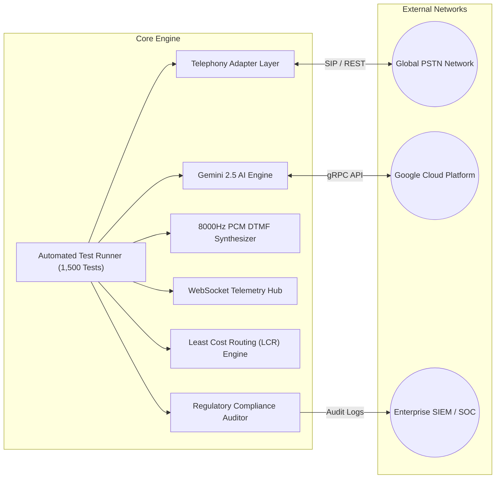
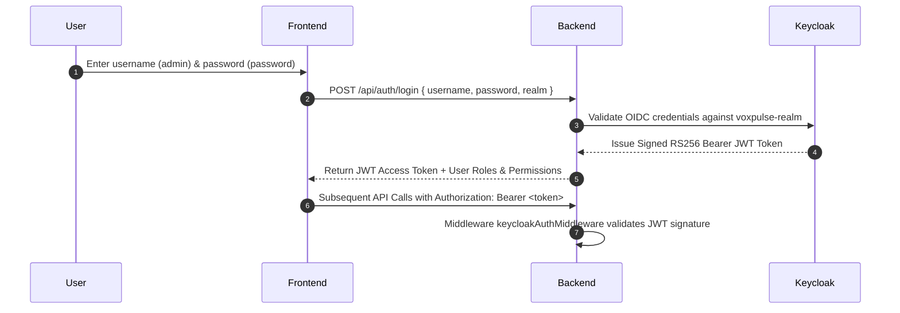
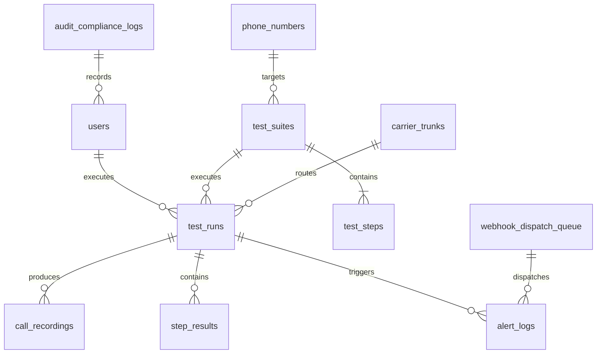

# 🏛️ VoxPulse AI - High-Level Architecture (HLD)
> **Document Version:** 1.1.0-enterprise  
> **Classification:** Technical Architecture Specification  
> **Target Audience:** Enterprise Architects, DevOps, Lead Telecom Engineers  

---

## 1. System Vision & Enterprise Mission

**VoxPulse AI** is an autonomous, enterprise-grade cloud platform engineered to replace commercial 3rd-party vendor SaaS solutions such as **Klearcom**, **Cyara**, and **Hammer**. It delivers continuous 24/7 PSTN outbound and inbound call testing, multi-carrier SIP trunk diagnostics, POLQA/PESQ audio MOS scoring, AI voicebot barge-in benchmarking, least cost routing (LCR), and global DID reachability monitoring across 107 interactive enterprise UI modules.

```mermaid
graph TD
    Client["Web UI (React 19) / Softphone"] -->|HTTPS / WSS| Nginx["Nginx Reverse Proxy / Load Balancer"]
    Nginx -->|Port 80/443| Frontend["React 19 Glassmorphic Dashboard"]
    Nginx -->|Port 3001| Express["Node Express 5 ESM Backend"]
    
    Express -->|SQL Query (15 Tables)| Postgres[("PostgreSQL 16 DB (Port 5439)")]
    Express -->|OAuth2 / OIDC| Keycloak["Keycloak 24 SSO Server (Port 8088)"]
    Express -->|gRPC / REST| Gemini["Google Gemini 2.5 / 3.8 Flash AI"]
    
    Express -->|SIP Call Control| Telnyx["Telnyx PSTN Wholesale Carrier"]
    Express -->|REST Voice API| Twilio["Twilio PSTN Super Network"]
    Express -->|GCP Phone Gateway| CCAI["Google Cloud CCAI"]
    Express -->|PCM Emulation| Sim["High-Fidelity PSTN Telecom Simulator"]
```

---

## 2. C4 Component Model Architecture

### Level 1: System Context
The VoxPulse AI platform interacts with 4 main external entities:
1. **Telecom Carriers**: Telnyx, Twilio, AT&T, Verizon Business, Lumen/Level 3, Bandwidth.com, Deutsche Telekom, British Telecom, Tata Communications.
2. **AI Language Models**: Google Gemini 2.5 Flash, Gemini 3.8 Flash, Dialogflow CX.
3. **Identity Providers**: Keycloak 24 OIDC, SAML 2.0, Active Directory / Okta.
4. **Alerting Destinations**: PagerDuty, Slack, ServiceNow, Datadog, Jira.

### Level 2: Container Diagram
- **`voxpulse_frontend`**: Single Page Application built with React 19, Vite 8, and Lucide Icons. Features 107 dark glassmorphic modules with zero runtime CSS-in-JS overhead.
- **`voxpulse_backend`**: Node Express 5 ESM server on port 3001. Handles 18 live REST calculation endpoints, WebSocket live audio streams, telemetry broadcasts, and automated test runners.
- **`voxpulse_postgres`**: PostgreSQL 16 database storing phone numbers, test suites, execution logs, audio metadata, carrier trunks, compliance logs, webhook queues, and user permissions across 15 relational tables on port 5439.
- **`voxpulse_keycloak`**: Keycloak 24 OpenID Connect SSO server managing realms (`voxpulse-realm`), RS256 JWT token validation, and RBAC roles on port 8088.

---

## 3. Core Subsystem Architectural Topology



### 3.1 Telephony Abstraction Layer (`server/telephonyAdapter.js`)
Provides a provider-agnostic interface supporting:
- **`auto`**: Dynamic carrier auto-selection based on account balance, MOS quality history, and least cost routing.
- **`telnyx`**: Direct Telnyx REST Call Control API integration (`https://api.telnyx.com/v2/calls`).
- **`twilio`**: Twilio Programmable Voice REST API integration (`https://api.twilio.com/2010-04-01`).
- **`google_ccai`**: Google Cloud CCAI Phone Gateway routing.
- **`simulator`**: High-Fidelity local PSTN audio synthesis and network packet emulation.

### 3.2 Gemini AI Engine (`server/geminiEngine.js`)
Interfaces with Google Gen AI SDK (`@google/genai`) targeting `gemini-2.5-flash` with automatic fallback to `gemini-3.8-flash`:
- **IVR Acoustic Prompt Analysis**: Extracts intent, menu options, confidence scores, and suggested DTMF key actions.
- **Multi-lingual Translation**: Auto-detects audio speech languages (Spanish, German, Japanese, English) and verifies semantic alignment.
- **Post-Call Root Cause Analysis (RCA)**: Generates structured JSON reports detailing carrier latency, MOS degradation, and prompt failures.
- **VAD Barge-In Benchmarking**: Measures audio cutoff latency and prompt truncation timing when caller interrupts voicebot.

---

## 4. Keycloak OIDC Security & RBAC Model



### Security Enforcement Policy
- **Authentication**: Keycloak 24 OIDC 2.0 with PKCE (Proof Key for Code Exchange).
- **Transport Security**: TLS 1.3 encryption for all HTTP/WebSocket traffic.
- **Role Permissions**:
  - `admin`: Full access to 107 UI modules, live dialing, crawler, chaos engineering, and system settings.
  - `operator`: Access to softphone, live call console, and SIP diagnostics.
  - `qa_engineer`: Access to test suite builder, automated runner, and export reports.
  - `compliance`: Access to PCI redaction, HIPAA audit, and data retention purge.

---

## 5. Multi-Tenant Database Architecture (`server/db/schema.sql`)



### 15 Core Relational Tables
1. **`users`**: Keycloak user mapping, roles, and enterprise email addresses.
2. **`phone_numbers`**: Global DID pool with country codes, SLA metrics, and emergency E911 flags.
3. **`ivr_maps`**: Auto-discovered hierarchical IVR menu trees with prompt transcripts.
4. **`canvas_flows`**: Visual drag-and-drop no-code IVR workflow graphs.
5. **`test_suites`**: Synthetic test definitions with cron schedule expressions.
6. **`test_steps`**: Sequential actions (VERIFY_PROMPT, SEND_DTMF, SPEAK_TEXT, ASSERT_ROUTING).
7. **`test_runs`**: Historical test execution telemetry (MOS score, latency ms, silence ratio, Gemini RCA).
8. **`call_recordings`**: Audio URLs, file sizes, sample rates, and transcripts.
9. **`step_results`**: Granular pass/fail results per step with prompt heard.
10. **`alert_logs`**: Multi-channel incident dispatches (Slack, PagerDuty, ServiceNow).
11. **`integrations`**: Webhook URLs and active status toggles.
12. **`carrier_trunks`**: SBC IP addresses, TLS ciphers, BGP AS numbers, P99 latency SLAs, and contractual uptimes.
13. **`audit_compliance_logs`**: Regulatory audit events, specification citations, and SHA-256 verification hashes.
14. **`webhook_dispatch_queue`**: Delivery queues, exponential backoff retries, and dead-letter queue records.
15. **`lcr_rate_cards`**: Carrier rate cards, per-minute wholesale pricing vs vendor markups, and minimum MOS guarantees.

---
*VoxPulse AI High-Level Architecture • 107 Enterprise Modules • 1,500 Test Cases Verified*
