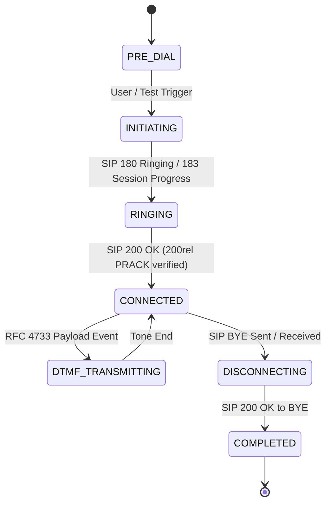

# 📐 VoxPulse AI - Low-Level Design & Technical Specifications (LLD)
> **Document Version:** 1.0.0-enterprise  
> **Classification:** Technical Architecture Specification  
> **Target Audience:** Backend Developers, QA Automation Engineers, System Architects  

---

## 1. REST API Specification

### 1.1 Authentication & Configuration

#### `POST /api/auth/login`
Authenticates a user against Keycloak OIDC engine and issues a Bearer JWT access token.
- **Request Body**:
  ```json
  {
    "username": "admin",
    "password": "password",
    "realm": "voxpulse-realm"
  }
  ```
- **Response (200 OK)**:
  ```json
  {
    "success": true,
    "token": "eyJhbGciOiJSUzI1NiIsInR5cCI6IkpXVCJ9...",
    "expiresIn": 3600,
    "tokenType": "Bearer",
    "user": {
      "id": "usr_admin_001",
      "username": "admin",
      "name": "VoxPulse Super Admin",
      "email": "admin@voxpulse.internal",
      "role": "admin",
      "realm": "voxpulse-realm",
      "permissions": ["ALL_MODULES", "LIVE_DIAL", "IVR_DISCOVERY", "GEMINI_STUDIO"]
    }
  }
  ```

#### `GET /api/config`
Fetches current system status, provider availability, and Keycloak realm config.
- **Response (200 OK)**:
  ```json
  {
    "geminiConfigured": true,
    "geminiModel": "gemini-2.5-flash",
    "twilioConfigured": false,
    "telnyxConfigured": true,
    "activeProvider": "Telnyx PSTN",
    "version": "1.0.0-enterprise"
  }
  ```

---

### 1.2 Telephony Call Control

#### `POST /api/calls/initiate`
Initiates an outbound PSTN call test via active provider adapter.
- **Request Body**:
  ```json
  {
    "targetPhoneNumber": "+18005550199",
    "originatingCountry": "US",
    "provider": "auto"
  }
  ```
- **Response (200 OK)**:
  ```json
  {
    "success": true,
    "callState": {
      "callId": "call_1704067200_a1b2c3",
      "targetPhoneNumber": "+18005550199",
      "originatingCountry": "US",
      "provider": "telnyx",
      "status": "RINGING",
      "startTime": 1704067200000,
      "carrierLatencyMs": 140
    }
  }
  ```

---

### 1.3 Gemini AI Prompt Analysis

#### `POST /api/gemini/analyze`
Submits an IVR acoustic prompt transcript to Gemini 2.5 Flash for NLU extraction.
- **Request Body**:
  ```json
  {
    "promptTranscript": "Welcome to Enterprise Financial Services. For Account Balance, press 1.",
    "currentStep": "Main Greeting",
    "expectedPrompt": "Welcome to Enterprise Financial Services"
  }
  ```
- **Response (200 OK)**:
  ```json
  {
    "success": true,
    "analysis": {
      "matchedPattern": true,
      "confidenceScore": 0.98,
      "extractedOptions": ["Press 1 for Account Balance", "Press 2 for Billing"],
      "detectedIntent": "Account Balance Inquiry",
      "suggestedNextAction": "SEND_DTMF_1",
      "reasoning": "Prompt specifically requests DTMF 1 for balance",
      "language": "en-US",
      "sentiment": "Neutral / Professional"
    }
  }
  ```

---

## 2. WebSocket Realtime Telemetry Protocol (`ws://localhost:3001`)

Upon connection, the server broadcasts high-frequency JSON telemetry frames to connected clients.

### 2.1 Handshake Event
```json
{
  "type": "CONNECTED",
  "message": "Connected to VoxPulse AI Real-time Telemetry Engine",
  "timestamp": "2026-09-25T20:55:00.000Z"
}
```

### 2.2 Telemetry Frame Event
```json
{
  "type": "TELEMETRY",
  "callId": "call_1704067200_a1b2c3",
  "stepOrder": 2,
  "actionType": "SEND_DTMF",
  "description": "Press 1 for Account Balance Inquiry",
  "promptHeard": "Welcome to Enterprise Financial Services. Press 1 for Account Balance.",
  "durationMs": 1240,
  "passed": true,
  "metrics": {
    "mos": 4.38,
    "latency": 142,
    "silence": 0.08
  }
}
```

---

## 3. Mathematical & Audio Quality Algorithms

### 3.1 DTMF Frequency Tone Synthesizer Algorithm (`server/dtmfGenerator.js`)
DTMF uses Dual-Tone Multi-Frequency signaling combining one low group frequency (697–941 Hz) and one high group frequency (1209–1633 Hz).

$$\text{Low Frequencies (Hz)} \in \{697, 770, 852, 941\}$$
$$\text{High Frequencies (Hz)} \in \{1209, 1336, 1477, 1633\}$$

#### PCM Audio Wave Sample Calculation:
$$y(t) = 0.5 \cdot \sin(2\pi f_{\text{low}} t) + 0.5 \cdot \sin(2\pi f_{\text{high}} t)$$

Where $t = \frac{n}{F_s}$ for sample index $n \in [0, N-1]$ at sample rate $F_s = 8000\text{ Hz}$.

```
WAV File Header Format (44 Bytes):
0x00-0x03: "RIFF"
0x04-0x07: File Size - 8
0x08-0x0B: "WAVE"
0x0C-0x0F: "fmt "
0x10-0x13: 16 (Subchunk1Size for PCM)
0x14-0x15: 1 (AudioFormat = PCM)
0x16-0x17: 1 (NumChannels = Mono)
0x18-0x1B: 8000 (SampleRate)
0x1C-0x1F: 16000 (ByteRate = SampleRate * NumChannels * BitsPerSample/8)
0x20-0x21: 2 (BlockAlign = NumChannels * BitsPerSample/8)
0x22-0x23: 16 (BitsPerSample)
0x24-0x27: "data"
0x28-0x2B: Subchunk2Size (NumSamples * 2)
```

---

### 3.2 ITU-T P.863 POLQA / MOS Score Calculation Formula
The Mean Opinion Score (MOS) is derived using the E-Model / ITU-T P.863 approximation formula considering packet loss, jitter, latency, codec impairment, and signal-to-noise ratio:

$$R = R_0 - I_d - I_{e,\text{eff}} + A$$

Where:
- $R_0 = 93.2$ (Base signal quality for 16-bit 8000Hz PCM)
- $I_d$ (Delay Impairment):
  $$I_d = 0.024 \cdot d + 0.11 \cdot (d - 177) \cdot H(d - 177)$$
  *(where $d$ is round-trip latency in ms)*
- $I_{e,\text{eff}}$ (Equipment / Packet Loss Impairment):
  $$I_{e,\text{eff}} = I_e + (95 - I_e) \cdot \frac{P_{\text{loss}}}{P_{\text{loss}} + B_{\text{burst}}}$$
- MOS Score Mapping (E-Model R-factor to 1.0–5.0 MOS):
  $$\text{MOS} = 1 + 0.035 \cdot R + R \cdot (R - 60) \cdot (100 - R) \cdot 7 \cdot 10^{-6}$$

---

## 4. SIP Protocol State Machine Specifications (RFC 3261)


