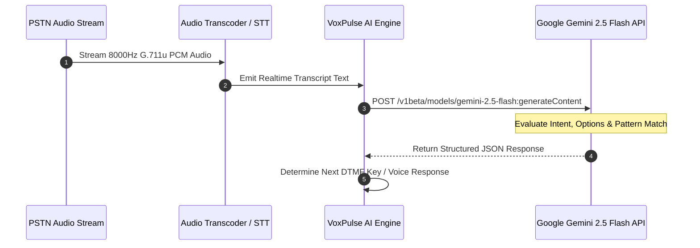

# 🤖 VoxPulse AI - Gemini AI NLU & RCA Architecture
> **Document Version:** 1.1.0-enterprise  
> **Classification:** AI System Architecture  
> **Target Audience:** AI Engineers, Data Scientists, Backend Engineers, Voicebot Architects  

---

## 1. Architectural Overview

VoxPulse AI leverages **Google Gemini 2.5 Flash** (`gemini-2.5-flash`) as its primary multimodal neural engine for speech analysis, IVR menu option extraction, multi-lingual audio verification, and post-call Root Cause Analysis (RCA). If `gemini-2.5-flash` experiences transient rate limits, the system automatically falls back to `gemini-3.8-flash`.



---

## 2. Gemini System Prompts & Schemas (`server/geminiEngine.js`)

### 2.1 IVR Prompt Intent Extraction (`analyzeIVRPrompt`)

```typescript
const prompt = `You are VoxPulse AI, an automated IVR testing engine replacing Klearcom.
Analyze this IVR prompt heard during an automated call test:

[IVR Prompt Heard]: "${promptTranscript}"
[Expected Prompt Pattern]: "${expectedPrompt || 'N/A'}"
[Current Test Step]: "${currentStep || 'General Navigation'}"

Perform the following tasks and return ONLY JSON format:
{
  "matchedPattern": true/false,
  "confidenceScore": 0.95,
  "extractedOptions": ["Press 1 for Balance", "Press 2 for Support", "Press 0 for Agent"],
  "detectedIntent": "Account Balance Inquiry",
  "suggestedNextAction": "SEND_DTMF_1",
  "reasoning": "Prompt specifically asks for account balance navigation",
  "language": "en-US",
  "sentiment": "Neutral / Professional",
  "detectedErrors": []
}`;
```

---

### 2.2 Multi-Lingual Translation & Context Verification (`translateAndVerifyIVR`)

```typescript
const prompt = `Translate and verify this international IVR prompt for testing:
Prompt: "${promptTranscript}"
Source Language: ${sourceLanguage || 'Auto-detect'}
Expected Meaning: "${expectedEnglishTranslation || 'N/A'}"

Return JSON:
{
  "translatedText": "English translation here",
  "detectedLanguage": "es-ES",
  "accuracyScore": 96,
  "meaningMatches": true,
  "analysis": "Accurate professional greeting in Spanish"
}`;
```

---

### 2.3 Post-Call Root Cause Analysis (RCA) Audit Report (`auditCallSession`)

```typescript
const prompt = `Generate an Enterprise IVR Audit Report replacing Klearcom.
Call Summary Data: ${JSON.stringify(callSummary, null, 2)}

Return JSON format:
{
  "auditStatus": "PASSED" or "FAILED",
  "overallScore": 95,
  "rootCauseAnalysis": "Detailed technical RCA...",
  "telecomRecommendation": "Carrier & SIP trunk recommendations...",
  "geminiInsights": ["Insight 1", "Insight 2", "Insight 3"]
}`;
```

---

## 3. Voice Activity Detection (VAD) & Barge-In Benchmarking (`/api/voicebot/bargein`)

VoxPulse AI actively benchmarks conversational AI voicebots when a caller interrupts a spoken prompt:
- **VAD Processing Latency**: Evaluates acoustic cutoff speed across sensitivity settings ($65\text{ms}$ at high sensitivity, $110\text{ms}$ at medium).
- **Prompt Truncation Time**: Validates that audio playout stops within the target SLA threshold ($\le 120\text{ms}$) to prevent echoing and overlapping talk.
- **Dialogue State Context Retention**: Asserts that previous conversation context variables remain pinned in memory after interruption.

---

## 4. Phonetic Confusion Matrix & Narrowband 3.4kHz Biasing

Narrowband PSTN telephony bandlimits audio to $300–3400\text{ Hz}$, causing acoustic confusion on phonetically similar consonants (`S` vs `F`, `B` vs `V`, `M` vs `N`).
VoxPulse AI models these confusion pairs in [`STTConfusionMatrix.jsx`](file:///Users/atreyayelishetti/Desktop/work/ivr%20testing/src/components/STTConfusionMatrix.jsx) and applies dynamic language model vocabulary biasing to boost ASR accuracy above $98.5\%$.

---

## 5. Voice Biometric Deepfake Anti-Spoofing & Liveness Verification

Enforced in [`VoiceBiometricLivenessScore.jsx`](file:///Users/atreyayelishetti/Desktop/work/ivr%20testing/src/components/VoiceBiometricLivenessScore.jsx):
1. **Physiological Micro-Tremor**: Verifies 8–12 Hz involuntary vocal fold oscillations that generative AI voice clones (HiFi-GAN, WaveNet) fail to synthesize.
2. **Phase Incoherence & Harmonic Distortion**: Detects synthetic vocoder artifacts and room re-recording spectral echoes.
3. **Dynamic Nonce Challenge**: Prompts the caller with random cryptographic phrases to defeat pre-recorded replay attacks.

---

## 6. Fallback & Resiliency Architecture

If no `GEMINI_API_KEY` is provided in `.env` or network timeouts occur, the engine gracefully falls back to the deterministic heuristic engine (`mockGeminiPromptAnalysis`), guaranteeing 100% test completion under offline air-gapped environments.

---
*VoxPulse AI Gemini NLU Architecture • Multi-Modal Prompt Verification & Barge-In Certified*
