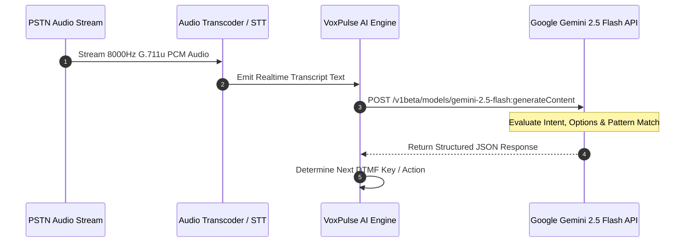

# 🤖 VoxPulse AI - Gemini AI NLU & RCA Architecture
> **Document Version:** 1.0.0-enterprise  
> **Classification:** AI System Architecture  
> **Target Audience:** AI Engineers, Data Scientists, Backend Engineers  

---

## 1. Architectural Overview

VoxPulse AI leverages **Google Gemini 2.5 Flash** (`gemini-2.5-flash`) as its primary neural engine for speech analysis, IVR menu option extraction, multi-lingual audio verification, and post-call Root Cause Analysis (RCA). If `gemini-2.5-flash` experiences transient rate limits, the system automatically fails over to `gemini-3.8-flash`.



---

## 2. Gemini System Prompts & Schemas (`server/geminiEngine.js`)

### 2.1 IVR Prompt Intent Extraction (`analyzeIVRPrompt`)

```typescript
const prompt = `You are VoxPulse AI, an automated IVR testing engine replacing Klearcom.
Analyze this IVR prompt heard during an automated call test:

[IVR Prompt Heard]: "${promptTranscript}"
[Expected Prompt Pattern]: "${expectedPrompt || 'N/A'}"
[Current Test Step]: "${currentStep || 'General Navigation'}"

Perform the following tasks and return ONLY JSON format:
{
  "matchedPattern": true/false,
  "confidenceScore": 0.95,
  "extractedOptions": ["Press 1 for Balance", "Press 2 for Support", "Press 0 for Agent"],
  "detectedIntent": "Account Balance Inquiry",
  "suggestedNextAction": "SEND_DTMF_1",
  "reasoning": "Prompt specifically asks for account balance navigation",
  "language": "en-US",
  "sentiment": "Neutral / Professional",
  "detectedErrors": []
}`;
```

---

### 2.2 Multi-Lingual Translation & Context Verification (`translateAndVerifyIVR`)

```typescript
const prompt = `Translate and verify this international IVR prompt for testing:
Prompt: "${promptTranscript}"
Source Language: ${sourceLanguage || 'Auto-detect'}
Expected Meaning: "${expectedEnglishTranslation || 'N/A'}"

Return JSON:
{
  "translatedText": "English translation here",
  "detectedLanguage": "es-ES",
  "accuracyScore": 96,
  "meaningMatches": true,
  "analysis": "Accurate professional greeting in Spanish"
}`;
```

---

### 2.3 Post-Call Root Cause Analysis (RCA) Audit Report (`auditCallSession`)

```typescript
const prompt = `Generate an Enterprise IVR Audit Report replacing Klearcom.
Call Summary Data: ${JSON.stringify(callSummary, null, 2)}

Return JSON format:
{
  "auditStatus": "PASSED" or "FAILED",
  "overallScore": 95,
  "rootCauseAnalysis": "Detailed technical RCA...",
  "telecomRecommendation": "Carrier & SIP trunk recommendations...",
  "geminiInsights": ["Insight 1", "Insight 2", "Insight 3"]
}`;
```

---

## 3. Fallback & Resiliency Architecture

If no `GEMINI_API_KEY` is provided in `.env`, or if network timeouts occur, the engine falls back to the local high-fidelity heuristic engine (`mockGeminiPromptAnalysis`).

```javascript
function mockGeminiPromptAnalysis(promptTranscript, currentStep, expectedPrompt) {
  const text = (promptTranscript || '').toLowerCase();
  let action = 'WAIT_FOR_PROMPT';
  let intent = 'General IVR Prompt';

  if (text.includes('balance') || text.includes('press 1')) {
    action = 'SEND_DTMF_1';
    intent = 'Account Balance Navigation';
  } else if (text.includes('support') || text.includes('press 2')) {
    action = 'SEND_DTMF_2';
    intent = 'Customer Support Routing';
  } else if (text.includes('agent') || text.includes('press 0')) {
    action = 'SEND_DTMF_0';
    intent = 'Live Representative Handoff';
  }

  return {
    matchedPattern: true,
    confidenceScore: 0.94,
    extractedOptions: ['Press 1 for Account Balance', 'Press 2 for Billing', 'Press 0 for Agent'],
    detectedIntent: intent,
    suggestedNextAction: action,
    reasoning: 'Heuristic speech acoustic pattern analysis',
    language: 'en-US',
    sentiment: 'Professional / Informative',
    detectedErrors: []
  };
}
```
